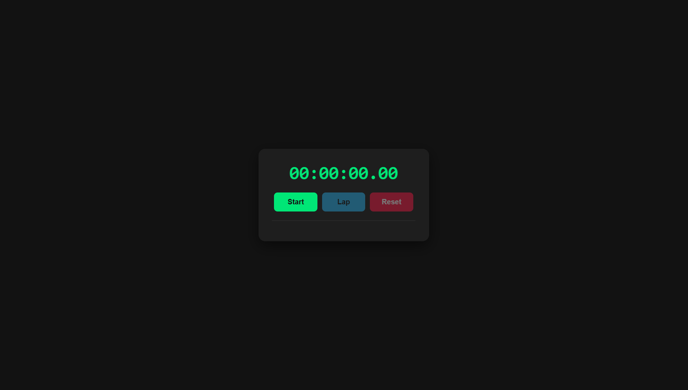
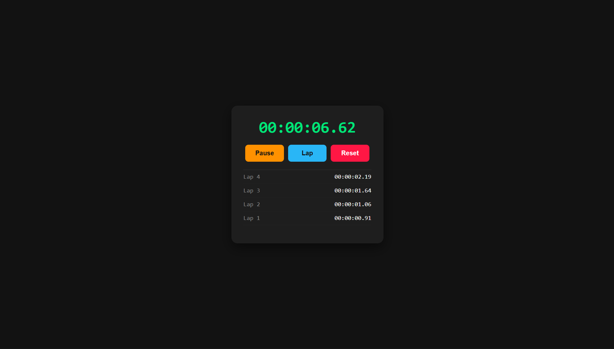

## STOPWTACH WEB APP ##
----------------------------------------------

A fully functional Stpowatch web application which contains functions for starting,pausing,and resetting the stopwatch,as well as tracking and displaying lap times.
Users can accurately measure nad record time.

    # Built with

      *HTML:To structure the elements of the application.
      *CSS:To style the web application.
      *JAVASCRIPT:To implement functionalities like lap and reset as well as adding interactivity.

  PREVIEW
  -----------
  
  

      *AUTHOR: Adhithya S U 
